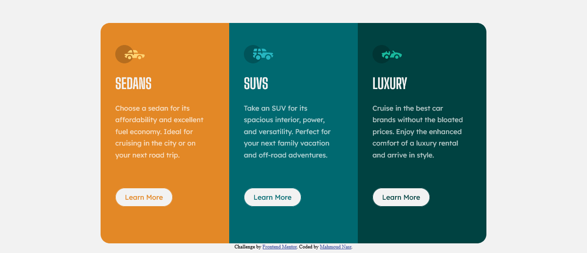

# Frontend Mentor - 3-column preview card component solution

This is a solution to the [3-column preview card component challenge on Frontend Mentor](https://www.frontendmentor.io/challenges/3column-preview-card-component-pH92eAR2-). Frontend Mentor challenges help you improve your coding skills by building realistic projects. 

## Table of contents

- [Overview](#overview)
  - [The challenge](#the-challenge)
  - [Screenshot](#screenshot)
  - [Links](#links)
- [My process](#my-process)
  - [Built with](#built-with)
  - [What I learned](#what-i-learned)
  - [Continued development](#continued-development)
  - [Useful resources](#useful-resources)
- [Author](#author)

**Note: Delete this note and update the table of contents based on what sections you keep.**

## Overview

### The challenge

Users should be able to:

- View the optimal layout depending on their device's screen size
- See hover states for interactive elements

### Screenshot



### Links

- Solution URL: [Site](./index.html)
- Live Site URL: [live site](https://your-live-site-url.com)

## My process

### Built with

- Semantic HTML5 markup
- CSS custom properties
- CSS Grid


### What I learned

Mobile View with simple CSS code

To see how you can add code snippets, see below:

```CSS
@media only screen and (max-width: 640px) {
    .parent {
      grid-template-columns: 100%;
      grid-column-gap: 0;
      grid-row-gap: 0;
      grid-template-rows: 30rem;
    }
    .SUVS{
        background-color:hsl(184, 100%, 22%);
        height:30rem;
    }

    .Luxury{

        background-color:hsl(179, 100%, 13%);
        border-top-right-radius: 0px;
        border-bottom-right-radius: 20px;
        border-bottom-left-radius: 20px;
        height:30rem;
    }

    .sedans{
        background-color:hsl(31, 77%, 52%);
        border-top-left-radius: 20px;
        border-bottom-left-radius: 0px;
        border-top-right-radius: 20px;
    }

  }
```


### Continued development

Want to know more about css grid and flexbox

### Useful resources

- [CSS Grid Generator](https://cssgrid-generator.netlify.app/) - This helped me creating a css grid with few clicks.
- [Button Generator](https://css3buttongenerator.com/) - Amazing to create button and the hover function.

## Author

- Frontend Mentor - [@nas22663](https://www.frontendmentor.io/profile/nas22663)
